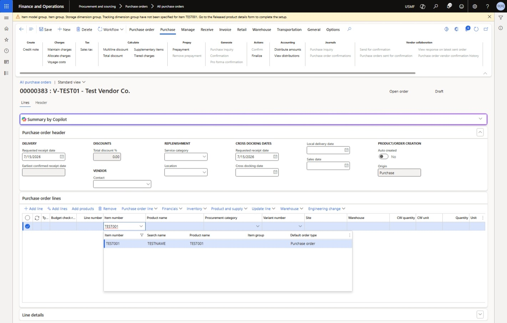
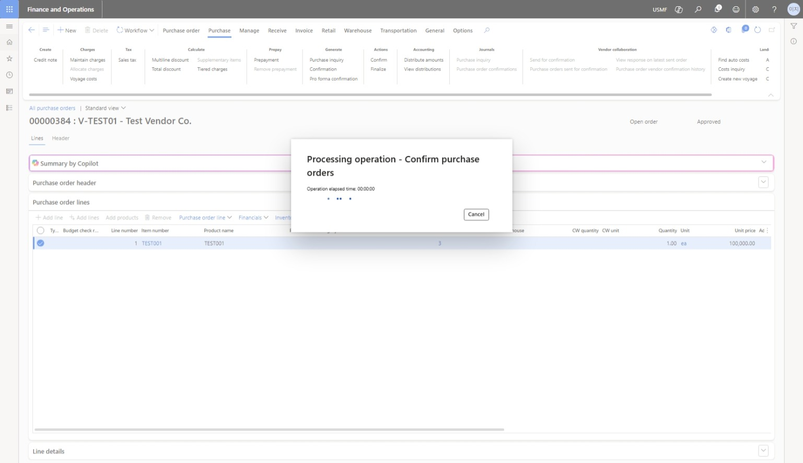

# 구매-판매-회계 연계 프로세스 가이드

**End-to-End Business Flow: Master Data → Procure-to-Pay → Order-to-Cash**

작성자: Serena Lee / 작성일: 2026-07-15 / 환경: USMF Sandbox

---

## 목적 (Purpose)

본 문서는 D365 Supply Chain Management에서 Customer/Vendor/Item 마스터 데이터 등록부터 구매(Procure-to-Pay), 판매(Order-to-Cash), 그리고 각 단계의 회계 전기(Voucher)까지 전체 흐름을 10단계로 정리한 실습 가이드입니다. 각 Step마다 스크린샷과 확인 포인트를 채워가며 완성합니다.

## 사전 조건 (Prerequisites)

- USMF 회사(Legal entity)로 로그인되어 있어야 함
- Accounts receivable / Accounts payable / Product information management / Procurement and sourcing / Sales and marketing 모듈 접근 권한 필요

## 전체 흐름도 (Overview)

```
마스터데이터(1~3) → 구매(4~7) → 판매(8~10), 마지막에 각 단계 회계 전기를 Voucher transaction으로 교차 확인
```

- Step 1~3: Customer, Vendor, Item 등록 및 릴리즈 — 아직 재고/회계 영향 없음, 정보만 등록
- Step 4~7: 구매주문 생성 → 입고 → 인보이스 → 지급 — Payable(줄 돈) 확정 및 청산
- Step 8~10: 판매주문 생성 → 출고 → 인보이스 → 수금 — Receivable(받을 돈) 확정 및 청산

---

## Part 1. 마스터 데이터 등록

### Step 1. Customer 신규등록
*Register a new Customer (Accounts Receivable)*

| 항목 | 내용 |
|---|---|
| **메뉴 경로** | `Accounts receivable > Customers > All customers > New` |
| **목적** | 향후 판매(Sales order) 시 선택할 고객을 마스터 데이터로 등록. Customer group 코드를 확인하여, 이 그룹이 어떤 회계 계정(매출채권)과 연결되는지 파악. |


**설명 / 확인 포인트:** Customer group 필드에 어떤 옵션이 있는지 확인. 등록 직후에는 재고/회계 영향이 전혀 없는 상태임을 확인.

---

### Step 2. Vendor 신규등록
*Register a new Vendor (Accounts Payable)*

| 항목 | 내용 |
|---|---|
| **메뉴 경로** | `Accounts payable > Vendors > All vendors > New` |
| **목적** | 향후 구매(Purchase order) 시 선택할 공급업체를 마스터 데이터로 등록. Vendor group 코드를 확인. |


**설명 / 확인 포인트:** Vendor group이 매입채무(AP) 계정과 어떻게 연결되는지 확인. Customer 등록과 구조가 동일한지 비교.

---

### Step 3. Item 등록 및 Released Product 릴리즈
*Register an Item, release it to Legal entity (USMF), and set the cost price*

| 항목 | 내용 |
|---|---|
| **메뉴 경로** | `Product information management > Products > All products > New`<br>`→ Release products (Legal entity: USMF 체크)`<br>`→ Manage costs 탭 > Price 필드에 원가 입력` |
| **목적** | 사고팔 대상 품목을 등록하고, USMF 법인에서 실제로 사용 가능하도록 릴리즈. 릴리즈 전에는 PO/SO에서 선택 불가. 원가(Cost price)가 없으면 Product receipt 단계에서 "No cost rollup" 에러 발생. |


**설명 / 확인 포인트:** All products에는 보이는데 Released products에는 안 보이면 릴리즈 누락. Release products 액션 실행 후 재확인. **Manage costs 탭의 Item group, Storage/Tracking dimension group, Product lifecycle state(Operational), Price(원가)까지 전부 채워져야 PO 라인 및 입고 처리가 정상 작동함.**

---

## Part 2. 구매 프로세스 (Procure-to-Pay)

### Step 4. Purchase Order 생성 및 확정
*Create Purchase Order, add lines, and Confirm*

| 항목 | 내용 |
|---|---|
| **메뉴 경로** | `Procurement and sourcing > Purchase orders > All purchase orders > New`<br>`→ Vendor 선택 → Add line으로 Item/수량/단가 입력 → Confirm` |
| **목적** | 벤더에게 보낼 공식 주문서를 생성하고 확정. Confirm 시점까지는 재고/회계에 영향 없음 ("주문서만 던진" 상태). |






**설명 / 확인 포인트:** Confirm 직후 PO 상태(Approval status / Purchase order status)가 "Confirmed"로 바뀌는지 확인. Change management가 설정되어 있으면 Confirm 전에 Submit → 승인(Approve) 절차가 먼저 필요.

---

### Step 5. Product Receipt 처리
*Process Product Receipt (Site/Warehouse/Location)*

| 항목 | 내용 |
|---|---|
| **메뉴 경로** | `PO 화면 > Receive > Product receipt`<br>`→ Site/Warehouse/Location 지정 → Post` |
| **목적** | 실제 입고를 기록. 이 시점부터 InventTrans 발생, 재고 수량(물리적) 증가. 회계는 잠정(Product receipt accrual) 계정만 걸림. |


**설명 / 확인 포인트:** Inventory management > Inquiries > Transactions에서 Receipt 컬럼이 "Received"로, Physical date에 오늘 날짜가 채워졌는지 확인. Item에 원가(Cost price)가 없으면 "No cost rollup is found for this item" 에러로 처리가 취소되므로, Step 3에서 원가 설정이 선행되어야 함.

---

## Part 3. 판매 프로세스 (Order-to-Cash)

### Step 8. Sales Order 생성 및 확정
*Create Sales Order and Confirm*

| 항목 | 내용 |
|---|---|
| **메뉴 경로** | `Sales and marketing > Sales orders > All sales orders > New`<br>`→ Customer 선택, 라인 입력 → Confirm` |
| **목적** | 고객으로부터 받은 주문을 등록하고 확정. 구매의 PO Confirm과 동일한 논리 — 이 시점까지 재고/회계 영향 없음. |

**[ 스크린샷 삽입 위치 ]**

**설명 / 확인 포인트:** 구매(Step 4)와 비교하여 화면 구조와 필드가 어떻게 대칭되는지 확인.

---

### Step 9. Packing Slip 처리 및 Sales Invoice 발행
*Process Packing Slip (Outbound) and issue Sales Invoice*

| 항목 | 내용 |
|---|---|
| **메뉴 경로** | `SO 화면 > Picking and shipping > Packing slip → Post`<br>`→ Invoice > Sales invoice → Post` |
| **목적** | 실제 출고를 기록(재고 감소, InventTrans 반대방향 발생)한 뒤, 인보이스를 발행하여 매출채권(AR)을 확정. |

**[ 스크린샷 삽입 위치 ]**

**설명 / 확인 포인트:** 구매의 Product Receipt(입고) ↔ 판매의 Packing slip(출고)이 정확히 대칭 관계임을 확인.

---

### Step 10. Customer Payment 및 Settle
*Customer Payment Journal → Settle, 회계전기 확인*

| 항목 | 내용 |
|---|---|
| **메뉴 경로** | `Accounts receivable > Payments > Payment journal > New`<br>`→ Line 입력 → Post → Settle` |
| **목적** | 고객으로부터 실제 수금을 처리하고 매출채권을 청산. 마지막으로 전체 10단계의 Voucher transaction을 모아서 회계 흐름을 종합 확인. |

**[ 스크린샷 삽입 위치 ]**

**설명 / 확인 포인트:** Customer의 Balance가 0으로 정리되는지 확인. General ledger > Inquiries > Voucher transactions에서 1~10단계 전체 전표를 시간순으로 조회.

---

## 핵심 정리 (Key Takeaways)

- 마스터 데이터(Customer/Vendor/Item)는 등록 시점에 재고·회계 영향이 없다. 실제 영향은 거래(Transaction)가 발생할 때부터 시작된다.
- **Item은 등록·릴리즈만으로 끝나지 않는다.** Item group, Storage/Tracking dimension group, Product lifecycle state(Operational), 원가(Cost price)까지 채워져야 실제 거래(PO 라인, 입고)에 사용 가능하다.
- 구매에서는 입고(Product Receipt)가 항상 인보이스보다 먼저 온다. 물리적 확정과 재무적 확정은 별개 단계다.
- 구매(Procure-to-Pay)와 판매(Order-to-Cash)는 방향만 반대이고 로직은 동일한 대칭 구조다.
- Accounts Payable(줄 돈)에는 Vendor가, Accounts Receivable(받을 돈)에는 Customer가 속한다.
- 모든 거래는 최종적으로 Voucher(전표)를 통해 General Ledger에 전기된다.

---

**Author:** [@serelee08](https://github.com/serelee08)
